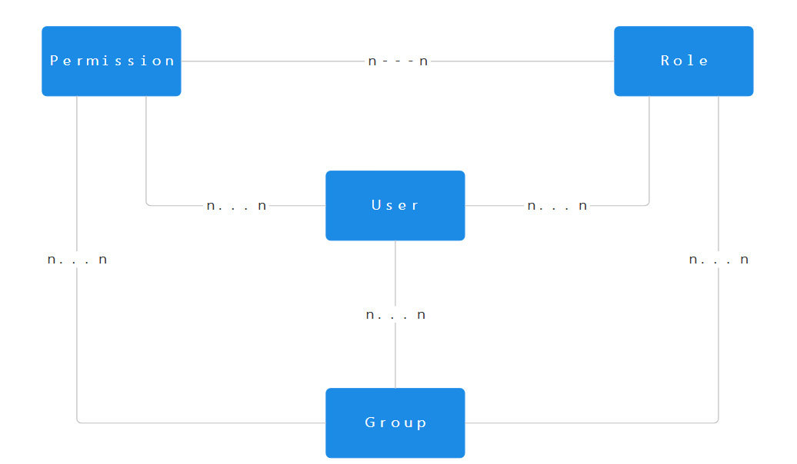
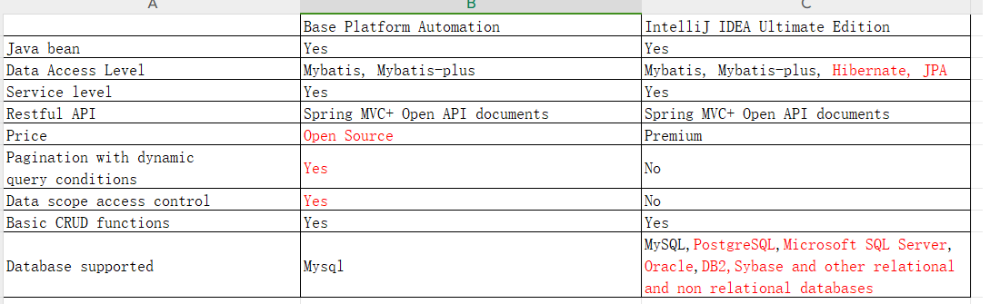

# 

Base Platform

## Introduction

The Base Platform is a simple generic platform flexible for different scenrios. It is build on top of a general data model that can fulfil access control requirements however diverse the scenarios can can be.It also generalizes a common set of building blocks agnostic to specific business usage of different scales. Though the majority of the framework is set, it is still a work in progress.

## Flexibility

**User**: 
A stakeholder that can login the system to use its functionalities. 
**Permission**: 
A unique token to represent a user's allocated resources of the system. The resources comprises HTTP Restful interface, static HTTP UI components. 
**Role**: 
A template set of permissions designated to a specific type of business operator. It simplifies user permission assignment. 
**Group**: 
A collection of users who share a common purpose or need to access similar resources. Groups can be used to manage user accounts and permissions collectively. For instance it can be used for a temporary workforce external to a cooperation. 
**Relations**: 
For any 2 entities of User, Permission, Role and Group there is a multiple-to-multiple relationship between them. I semantic of the relationship is self explanatory as per the ER diagram and I shall not elaborate.This generic and comprehensive access control data model maximizes the framwork's adaptability to different authorization requirements of different business scenarios.

 
The flexibility of the Basic Platform also lends itself to the applications of different scale and business maturity.By tweaking on the maven profile of each micro service, each micro service can be either packaged in to a autonomous 
Spring boot micro service jar or a library jar that is refenerence by a higher level web application. For corporate scenarios, an all-in-one application could probably be a good fit. The same holds true for projects at the early stage  
of domain driven design, as the solution avoid basing comlexity on volatile business functions, instead it should build upon business functions they are certain and not susceptble to change according to the first principles. 

## Modules

**Automation** 
A Spring boot application for developers usages only. Like code generate from Intellij Idea, it can generate stub codes from a relational data schema and unlike that of Intellij Idea it does much more.

 
In particular, data scope access control applies to the predominant corporate scenario where for the same type data resources, indviduals and corporate organizations need to share data with each other. This is implemented by introducing a sharing pool table in the database to manage the sharing relations between individuals and organizations. The data access query a joined with the sharing pool table, functionalities are auto generate all the way up to the controller level with a dynamic condition query supporting pagination. The data sharing strategry can be configured to a data dictionary table via web UI. For example, the strategy can look like this: "For resources of air monitoring sensors, the data should only visible to the data entry person with special rule that the sensor data enter by Henderson environment council should be visible to Auckland environment council". If interested in implementation, the DataIsonlationAspect class in the common services is the entry point to look into.  

A simple user manually to use the automation service is availble under the Automation module.

**User Service** 
This is moudle or micro service that manages all tenant, user, persission, role , group and organization and application data. The concept of applications could be web or mobile applications ported per device. Permission set can be tailored for the same application for the different tenants. It can be augmented with user related data and funtionalities. 

**Common Service** <dr>
The service takes charge of business neutral functionalities like file management, data dictionary, internationalization, logging, data scope sharing, etc. It also encapsulate building block libraries like proprietary algorithm, date utils, string utils and cache tools etc. Last but not least, at the early stages of DDD, it is likely embedded in the other applications. All the Spring boot configuration classes are pushed down to the common service. 

**Order Service**  
The order service takes care of each tenant's order for its own suite of functialities. The orders can be extended in length augmented or shrinked for functionality as the time lapses.  

**Job Service**  
A standalone Spring boot application that manages the scheduled jobs. 

**Middleware** 
This is a service that works in the message pipework that normalizes messages towards a canonical format. Thus the down stream business systems be relieved of device compatibility concerns and focus on business function implementation. The implementation of message formatting and routing is implemented in a way that requires no coding. The operation engineering can edit the configuarion file on a web UI using Apache Camel Spring DSL. 

**customer-userprovider**  
There are customers that mandates on premises deployment and has its own authorization and authentication systems like IDP and STS. In order for these types of customers to access open services backed by the Base Platform (BP) the customer-userprovider is an extension module for the Keycloak IAM that enables federated authentication and authorization. This extension can map the customer's role to the roles of the BP, so that the customer can invoke
open HTTP APIs while remaining under the central permission control of the operations of the BP.  

**Biz Service**  
The biz service is the actual service that implements industry specific functionalities on the building blocks of the aforementioned different aspects of industry agnostic services/modules. As of this point in time, all other services are embedded library modules of the biz service. The framework is flexible for modification alongside the DDD process. 

## Work In Progress

**Support for more databases**  
**Format optimization for generated code** 
**Implementation of OAuth 2 Flow for A & A**  
Currently the BP is only using JWT based on home made synmetric encryption.
