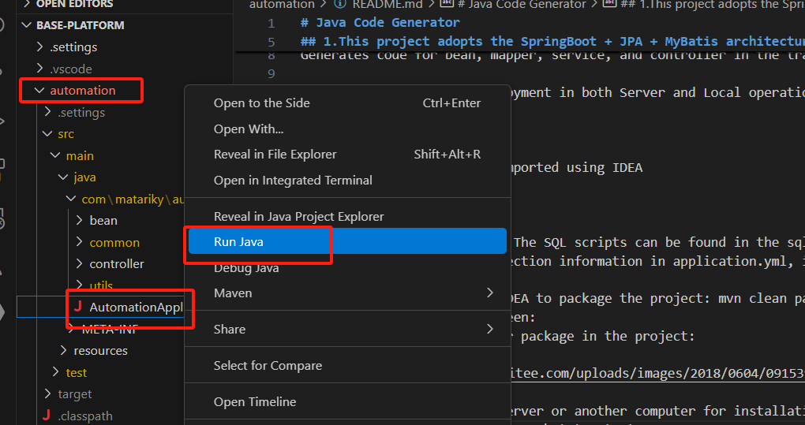

# Java Code Generator

#### Project Introduction

## 1.This project adopts the SpringBoot + JPA + MyBatis architecture

2.Main Features:
Generates code for bean, mapper, service, and controller in the traditional SpringMVC development model

3.The project supports deployment in both Server and Local operation modes

#### Software Architecture

The SpringBoot project is imported using IDEA

#### Installation Guide

1. Create a MySQL database. The SQL scripts can be found in the sql folder. The database name: automation
2. Update the database connection information in application.yml, including the port number and log file history folder path file.url
3. Use the mvn command in IDEA to package the project: mvn clean package
4. Successful packaging screen:
   5.The location of the jar package in the project:

6.Copy the project to the server or another computer for installation (The environment must be JDK 17)  7.Use the command to start the project: java -jar automation.jar

Note: Navigate to the parent directory of the jar file, hold Shift + Right Click, then select "Open Command Window Here" and enter the start command: java -jar automation.jar. If the following page appears, the startup is successful:

8.Access the application in the browser using IP Address:Port

**Ensure you use your actual IP Address. For local access, use 127.0.0.1 instead of localhost**

#### Usage Instructions

a. Code Download

1. Open the webpage as shown below:
   
2. Enter the package name and connect to the database:
   
3. Select the table name and check the fields for which bean, mapper, service, and controller mappings need to be generated:
    4.Click submit to generate and download the code:
   

b. Database Design Document Export

1.Open the interface, enter database connection details, read the database, select all or specific tables, and click export:

