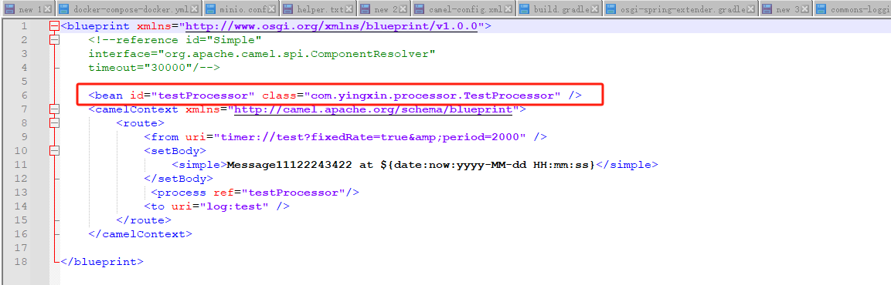

Matariky-message-processor

1 Download karaf 4.4.5
https://www.apache.org/dyn/closer.lua/karaf/4.4.5/apache-karaf-4.4.5.zip

2 Update {karaf directory}\etc\user.properties

Enter a line as below：
karaf = karaf,_g_:admingroup
_g_\:admingroup = group,admin,manager,viewer,systembundles,ssh
This is to configure default hawtio default user name and password。The default credentials are karaf:karaf

3 Inside the bin director run .\karaf.bat
Start karaf. After successful start up the karaf console looks like this

4 Install karaf features
feature is karaf's integral integration modules . It comprises the endpoints of all types of protocols alongside other tools like apache commons utils ,jaxb axis, Gson, etc。The integration middleware needs to leverage the features:

4.1 hawtio: a web console ,which is used to manage the life cycle of all the osgi bundles running on Karaf.The management capabilities include start, stop, check the current status and dependencies of a particular bundle.

feature:repo-add hawtio
feature:install hawtio

4.2 For dynamic Configuration of integratioin of routing rules ,integration endpoint , Message formatting logic etc.
feature:repo-add camel

4.3 Install camel components like kafak mqtt, http, jms etc. All the components runs inside karaf runtime and requires no extra storage volume.
feature:install camel

4.4 camel-stream provides karaf command to check the Current camel context routes as well as Activate /Deactivate these artifacts.
feature:install camel-stream

4.5 Supports the xsd definition for meta data Sping camel DSL
feature:install camel-blueprint

When all 4 features aforementioned are completely installed, run list command to view all Activated karaf featrues as below:

5 For custom integration modules that is not available out of the box, such as Reader Message transformation, we can code the custom modules. For the details, refer the maven project for message-processors. The implementation
requries a simple java processor to normalize Message format, bundle it into OSGI bundle jar and then place it under the deploy folder.

7 In the above image test.xml is a camel-blueprint for Spring Camel DSL, the changes to the Camel DSL configuration can take effect dynamically.

Among which, the testProcessor is messageProcessor is a custom defined java bean.

8 Common karaf commands：

**list:**  view Current OSGI bundles and their states. 
bundle:diag 123 
view bundle with ID 123 and the dependency resolution for that bundle, display error logs to troubleshoot 
**log：** 
clear Log 
**log:tail** 
follow the Latest Logs of a bundle 
**log:** 
Print the Latest Log of a bundle without following 
**start 1234:** 
start the bundle with ID 1234 
**stop 1234:** 
Stop the bundle with ID 1234 
**resolve 1234:** 
resolve dependencies for bundle ID 1234 
**headers 1234** 
Check the meta-info of a bundle in the head of the bunders meta-info 

9 Hawtio console is used for checking the camel context and the deployment of the osgi bundles and camel features.
http://localhost:8181/hawtio
karaf:karaf

